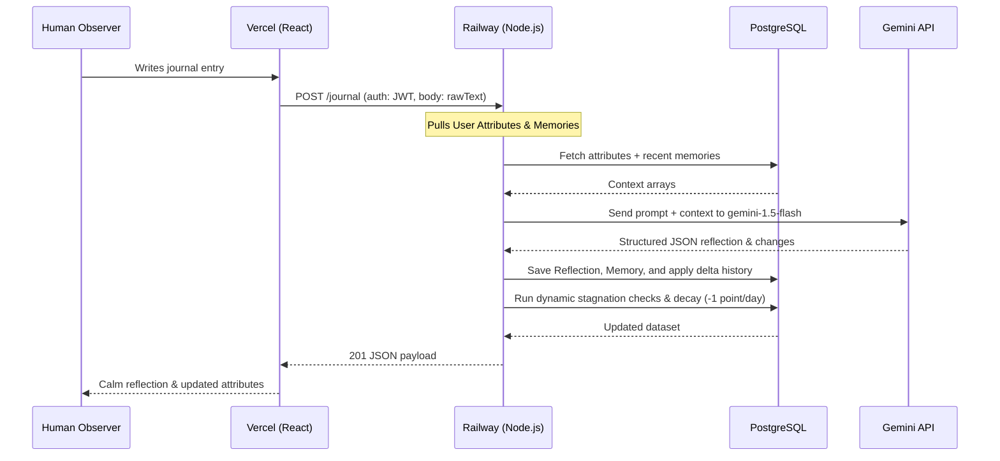

# SkillTree Production Deployment Guide 🌙

This document outlines the step-by-step instructions to deploy the **SkillTree** system to production.

- **Backend**: Hosted on **Railway** with a **PostgreSQL** database.
- **Frontend**: Hosted on **Vercel** (Vite + React SPA).

---

## 1. Backend Deployment (Railway)

Railway automates deployment using the configured [railway.toml](file:///c:/Users/KETAN/OneDrive/Desktop/skillTree/backend/railway.toml) and [nixpacks.toml](file:///c:/Users/KETAN/OneDrive/Desktop/skillTree/backend/nixpacks.toml) files.

### Step-by-Step Setup:
1. Go to the [Railway Dashboard](https://railway.app/) and log in.
2. Click **New Project** → **Deploy from GitHub repo**.
3. Select the repository: `Ketanagarwal32/SkillTreee`.
4. In the service settings, set the **Root Directory** to `/backend`.
5. Under the **Variables** tab, click **+ Add Service** and choose **PostgreSQL**. This spins up a PostgreSQL database instantly and injects the `DATABASE_URL` variable automatically into the backend service.
6. Under the **Variables** tab, add the following manual environment variables:

| Variable Name | Required Value / Description | Example / Note |
| :--- | :--- | :--- |
| `DATABASE_URL` | *Injected automatically by Railway* | *Do not overwrite* |
| `PORT` | *Injected automatically by Railway* | Defaults to `3000` |
| `NODE_ENV` | `production` | Enables performance optimizations |
| `JWT_SECRET` | A long, secure random string for JWT signature verification | e.g. `c010a30b...` |
| `GEMINI_API_KEY` | Your Google Gemini API Key from Google AI Studio | `AIzaSy...` |
| `FRONTEND_URL` | The production domain of your Vercel frontend | e.g. `https://skilltree.vercel.app` |

7. Save and deploy. Railway will run `npm ci`, build the TypeScript distribution, apply database migrations (`npx prisma migrate deploy`), and boot the server.

---

## 2. Frontend Deployment (Vercel)

Vercel hosts the React client-side application. It uses [vercel.json](file:///c:/Users/KETAN/OneDrive/Desktop/skillTree/frontend/vercel.json) to handle routing rewrites for client-side deep links.

### Step-by-Step Setup:
1. Go to the [Vercel Dashboard](https://vercel.com/) and log in.
2. Click **Add New** → **Project**.
3. Import the repository: `Ketanagarwal32/SkillTreee`.
4. In the project configure settings:
   - **Root Directory**: Select `frontend`.
   - **Framework Preset**: Select `Vite` (detected automatically).
   - **Build Command**: `npm run build`
   - **Output Directory**: `dist`
5. Under the **Environment Variables** section, add the API endpoints:

| Variable Name | Required Value / Description | Note |
| :--- | :--- | :--- |
| `VITE_API_URL` | The production URL of your Railway backend service | e.g. `https://skilltree-production.up.railway.app` *(Do not add a trailing slash)* |

6. Click **Deploy**. Vercel compiles the assets and distributes them globally.

---

## 3. Dynamic Environment Linking Flow

---

## 4. Verification Check

Once both services are deployed:
1. Open the Vercel frontend URL.
2. Try registering a user to check frontend-backend database integration.
3. Submit a serene reflection journal entry.
4. Verify the Buddhist monk response is generated and attributes dynamically update in your profile.
